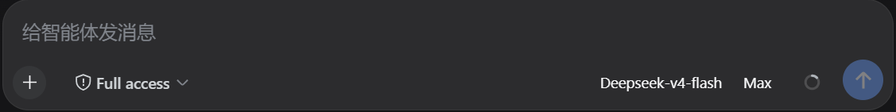
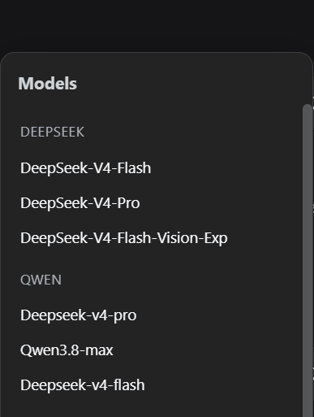
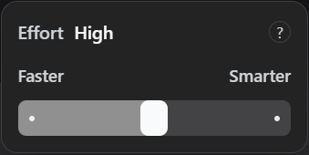
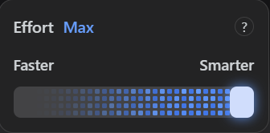

# @domitor-syh/dsh-ui-skin-switcher

[中文](./README.md) | English

A **Claude Desktop-style switcher** plugin for the [DeepSeek Harness](https://github.com/deepseek-ai/deepseek-harness) (DSH) Web GUI: a floating "seat" next to the input box for picking a model and dialing reasoning effort — dropdown for models, slider for effort.

## What it is

`dsh-ui-skin-switcher` registers the `conversation.input.model` slot and renders a model + reasoning-effort switcher seat next to the composer input.

It rides the exact same channel the first-party selector uses: it reads the provider-grouped model directory through `session.models` and submits through `session.selectModel`, so a switch made here is what `/model` shows next and takes effect on the current session.

The style pays homage to Claude Desktop's switcher — slider feel, rounded track, hover highlight.

## Features

| Feature | Detail |
| --- | --- |
| Model switching | Clicking the model entry expands the model list ordered by vendor; the selection applies immediately and the matching reasoning effort updates together |
| Effort slider | Supports both click and drag, with multiple effort nodes; supported levels differ per model, and adjustments apply immediately |
| Max-effort dot matrix | Reaching max effort reveals a right-to-left dot-matrix sweep on the track, with the handle glowing |
| Per-model memory | Remembers the last effort per model, kept across switches |
| Theme adaptive | All colors bound to DSH theme tokens; readable in light/dark themes and transparent skins |

## Screenshots

**Overall** — the button next to the input box:



**Model switcher** — model list grouped by vendor:



**Effort switcher (normal)** — switcher style:



**Effort switcher (max)** — switcher style (triggers dot-matrix animation):



## Install

With the DSH CLI installed:

```sh
dsh plugin --profile web add @domitor-syh/dsh-ui-skin-switcher
```

Restart `dsh web` — the button appears next to the input box.

Running dsh from source? Inside the repo root, use your launch command plus `dsh plugin --profile web add @domitor-syh/dsh-ui-skin-switcher`, for example:

```sh
# Normal start
pnpm dsh web
# Add the plugin
pnpm dsh plugin --profile web add @domitor-syh/dsh-ui-skin-switcher
```

### Verify & uninstall

Restart `dsh web` — the button appears next to the input box and takes effect immediately. Verify with `dsh --profile web --dump-config`.

Uninstall (if running from source, uninstall the same way you installed): `dsh plugin --profile web remove @domitor-syh/dsh-ui-skin-switcher`, then restart `dsh web`.

## Usage

1. **Pick a model** — click the button and pick from the list; the list is grouped by vendor and the current model shows a checkmark.
2. **Dial effort** — for models declaring `reasoningEfforts`, an effort button appears to the right of the model; click it, then drag the slider or tap the track to switch levels.

### Why is there no reasoning-effort switcher after adding a model?

The current model does not declare a reasoning effort (`reasoningEfforts`) or vision capability. To keep model declarations accurate, we do not apply a uniform effort preset to every model — check the model vendor's official documentation and patch the underlying config file yourself, or hand the vendor's deep-thinking documentation (or its link) to the LLM and let it modify the config directly.

> Taking effect: changes made by the LLM through configuration apply **immediately** with no restart; manually editing the underlying model config file requires restarting `dsh web`.

We are progressively declaring reasoning efforts for models across vendors. If the effort switcher does not appear, patch it per the documentation above or wait for our incremental support.

## License

[MIT](./LICENSE)