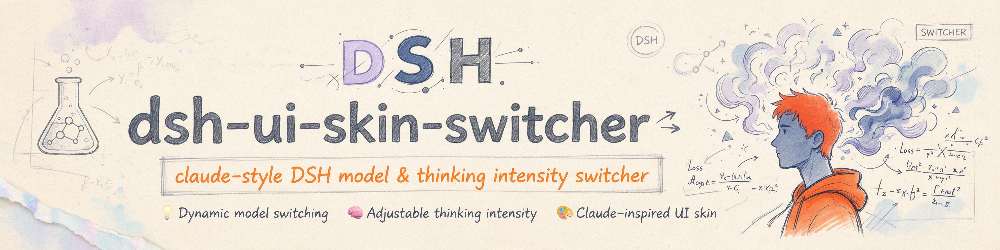

<h1 align="center">@domitor-syh/dsh-ui-skin-switcher</h1>

<p align="center">
  
</p>

<p align="center"><a href="./README.md">中文</a> | English</p>

<p align="center">
  <a href="https://awesome-dsh-plugin.com"></a>
  <a href="https://awesome-dsh-plugin.com"></a>
  <a href="https://www.npmjs.com/package/@domitor-syh/dsh-ui-skin-switcher"></a>
  <a href="https://www.npmjs.com/package/@domitor-syh/dsh-ui-skin-switcher"></a>
  <a href="./LICENSE"></a>
  <a href="https://github.com/domitor-syh/dsh-ui-skin-switcher/actions/workflows/ci.yml"></a>
</p>

A **Claude Desktop-style switcher** plugin for the [DeepSeek Harness](https://github.com/deepseek-ai/deepseek-harness) (DSH) Web GUI: a floating "seat" next to the input box for picking a model and dialing reasoning effort — dropdown for models, slider for effort.

> **Compatibility**: supports **DSH 0.1.5 and newer** only.

## What it is

`dsh-ui-skin-switcher` registers the `conversation.input.model` slot and renders a model + reasoning-effort switcher seat next to the composer input.

It rides the exact same channel the first-party selector uses: it reads the provider-grouped model directory and the current selection through `ctx.modelDirectories` — the same source the `/model` panel renders — and submits through that same selection call, so a switch made here is what `/model` shows next and takes effect on the current session.

The style pays homage to Claude Desktop's switcher — slider feel, rounded track, hover highlight.

## Features

| Feature | Detail |
| --- | --- |
| Model switching | Clicking the model entry expands the model list ordered by vendor; the selection applies immediately and the matching reasoning effort updates together |
| Effort slider | Supports both click and drag, with multiple effort nodes; supported levels differ per model, and adjustments apply immediately |
| Max-effort dot matrix | Reaching max effort reveals a right-to-left dot-matrix sweep on the track, with the handle glowing |
| Per-model memory | Remembers the last effort per model, kept across switches |
| Theme adaptive | All colors bound to DSH theme tokens; readable in light/dark themes and transparent skins |

## Video preview

<p align="center">
  <video src="https://github.com/user-attachments/assets/e2905bda-0e42-4f56-a3a0-7a545b958b03" controls muted loop playsinline width="100%"></video>
</p>

> **The inline player needs a GitHub sign-in** and cannot play while signed out; in that case click the **link below** to watch in a new tab.

**▶︎ [Watch the full demo video](https://cdn.jsdelivr.net/gh/domitor-syh/dsh-ui-skin-switcher@main/docs/dsh-ui-skin-switcher-demo.mp4)** — model switching, the effort slider, and the top-level dot-matrix animation.

## Compatibility

Supports **DSH 0.1.5 and newer** only.

| DSH version | Works | Notes |
| --- | :---: | --- |
| 0.1.5-alpha.1 … 0.1.5-rc.3 | ✅ | The whole 0.1.5 line; spot-checked at alpha.1, rc.2 (full end-to-end run) and rc.3 |
| 0.1.6-alpha.1 / alpha.2 | ✅ | Same generation as 0.1.5 |
| 0.1.7-alpha.1 / alpha.2 | ✅ | Newest published line; spot-checked at alpha.2 |
| 0.1.3-alpha.2 and earlier | ❌ | Older generation: only `connection.api`, no `remote.session` |

The dividing line is **0.1.5**: that release replaced the old `connection.api` face with `ctx.remote.session` / `ctx.modelDirectories` and dropped the `dsh-client-ui-slots` dependency. This plugin is built on the new interfaces, so it cannot load on earlier DSH versions.

> How this table was produced: each version's `dsh-client-ui-model-selection` package was unpacked and checked for the `modelDirectories` / `modelCatalog` / `selectModel` interfaces, plus a full end-to-end run on 0.1.5-rc.2.

## Install

With the DSH CLI installed:

```sh
dsh plugin --profile web add @domitor-syh/dsh-ui-skin-switcher
```

Restart `dsh web` — the button appears next to the input box.

Running dsh from source? Inside the repo root, use your launch command plus `dsh plugin --profile web add @domitor-syh/dsh-ui-skin-switcher`, for example:

```sh
# Normal start
pnpm dsh web
# Add the plugin
pnpm dsh plugin --profile web add @domitor-syh/dsh-ui-skin-switcher
```

### Verify & uninstall

Restart `dsh web` — the button appears next to the input box and takes effect immediately. Verify with `dsh --profile web --dump-config`.

Uninstall (if running from source, uninstall the same way you installed): `dsh plugin --profile web remove @domitor-syh/dsh-ui-skin-switcher`, then restart `dsh web`.

## Usage

1. **Pick a model** — click the button and pick from the list; the list is grouped by vendor and the current model shows a checkmark.
2. **Dial effort** — for models declaring `reasoningEfforts`, an effort button appears to the right of the model; click it, then drag the slider or tap the track to switch levels.

### Why is there no reasoning-effort switcher after adding a model?

The current model does not declare a reasoning effort (`reasoningEfforts`) or vision capability. To keep model declarations accurate, we do not apply a uniform effort preset to every model — check the model vendor's official documentation and patch the underlying config file yourself, or hand the vendor's deep-thinking documentation (or its link) to the LLM and let it modify the config directly.

> Taking effect: you edit `settings.yaml` under the DSH home (`~/.dsh`) — **not this plugin's files**; DSH watches that file and hot-reloads, so the change takes effect **immediately with no restart** and persists across restarts.

Why do it yourself? To keep declarations accurate — **accuracy over coverage**. Reasoning effort is a per-vendor, per-level wire value; a wrong value silently breaks requests, so we never fill in a guessed preset.

## License

[MIT](./LICENSE)